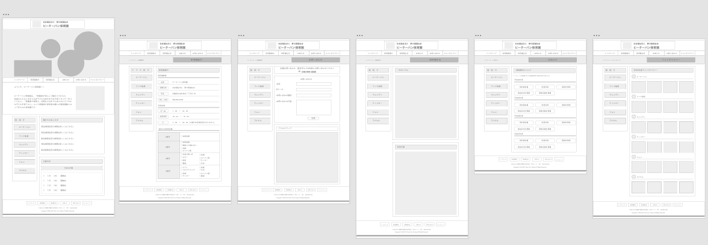
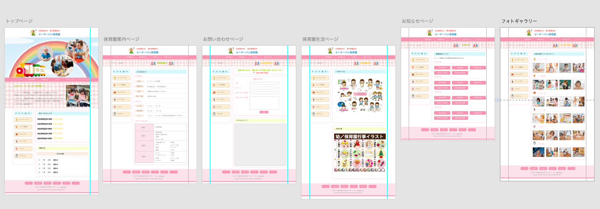

## プロジェクト

---

保育園の Web サイトを制作する。

この Web サイト制作は練習のため、架空の保育園サイトである。

名称を「ピーターパン保育園」とする。

Adobe XD を使用してワイヤーフレームとデザインカンプを行う。

HTML と CSS でコーディングを行う。

Web 版のみ（レスポンシブ未対応）

## 基本設計書

[保育園 Web サイト制作 基本設計書](https://docs.google.com/spreadsheets/d/1NhHNSZG-liwr7R1xmrXBefBGMAdNPT8KCBhuZf4qCFk/edit?usp=sharing)

## ワイヤーフレーム

---

## デザインカンプ

---

## 著者

---

[IT]()

- GitHub: [@IT](https://github.com/Ikko-T)

## コントリビューション

---

Contributions, issues and feature requests are welcome!

## ライセンス

---

(C)Copyright 2021 IT

"ピーターパン保育園" is under [MIT license](https://en.wikipedia.org/wiki/MIT_License).
